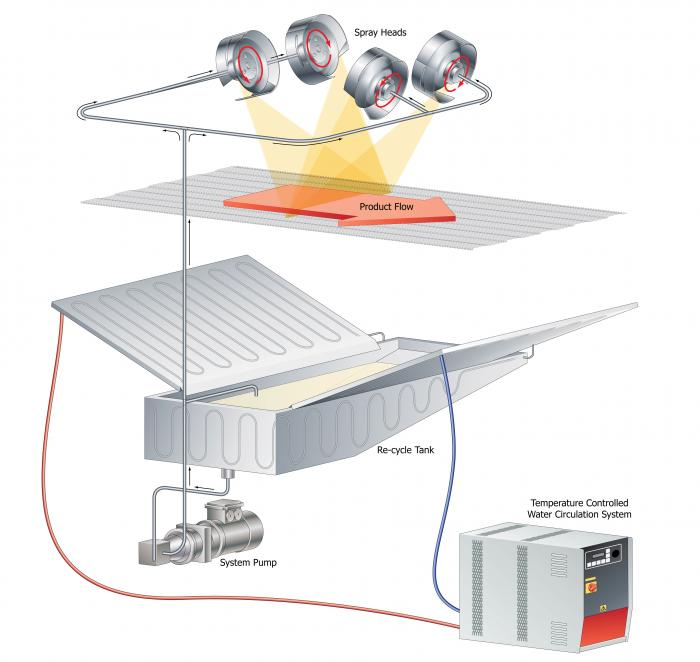
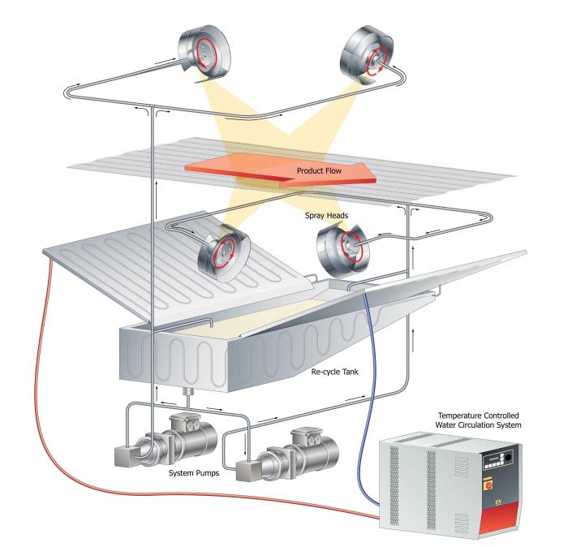
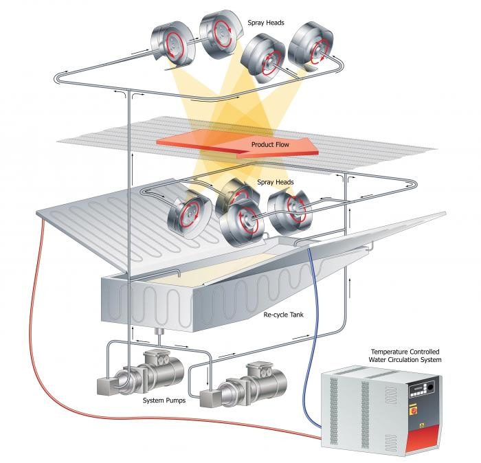

## Spraying at Temperatures

Not all food spraying can be accomplished at ambient temperature; some applications require that the spraying material is heated or chilled to a temperature other than that of its surroundings. There are typically three reasons why temperature is varied at the point of spray application.

### SAFETY

Certain spray materials such as real egg glaze/egg wash require constant chilling to stop the growth of bacteria within the spray medium. The EU’s directive on spraying of real egg glaze requires the medium to be maintained at a temperature of between 4-6 degrees centigrade. Chilled egg glaze has a longer active production life than non-chilled.

### EFFECTIVENESS
Typically the spray medium is easier to apply when the temperature is raised; since the medium is less viscous and can be applied thinly.

### AVAILABILITY
When spraying a supersaturated solution that cannot exist at ambient temperature; for example when spraying a high-value Brix sugar syrup solution. Here, the supersaturated solution could only exist in solution at temperatures above ambient.

### METHODOLOGY
Saturn Spraying augments its standard DiscMaster™ and DiscMatic™ design with double-skinned capillary-tracked radiating surfaces on its in-feed and out-feed drip trays, as well as the system reservoir; since these surfaces are in close contact with the spraying liquid. An external temperature control pack pumps food-safe coolant through the closed-loop system allowing close regulation of the temperature. The system temperature control pack is rated to be able to easily maintain the spray material at the desired temperature.

## TEMPERATURE CONTROLLED TOP & SIDES SIDES SPRAYING

## TEMPERATURE CONTROLLED ALL OVER SPRAYING 2D

## TEMPERATURE CONTROLLED ALL OVER SPRAYING 3D

