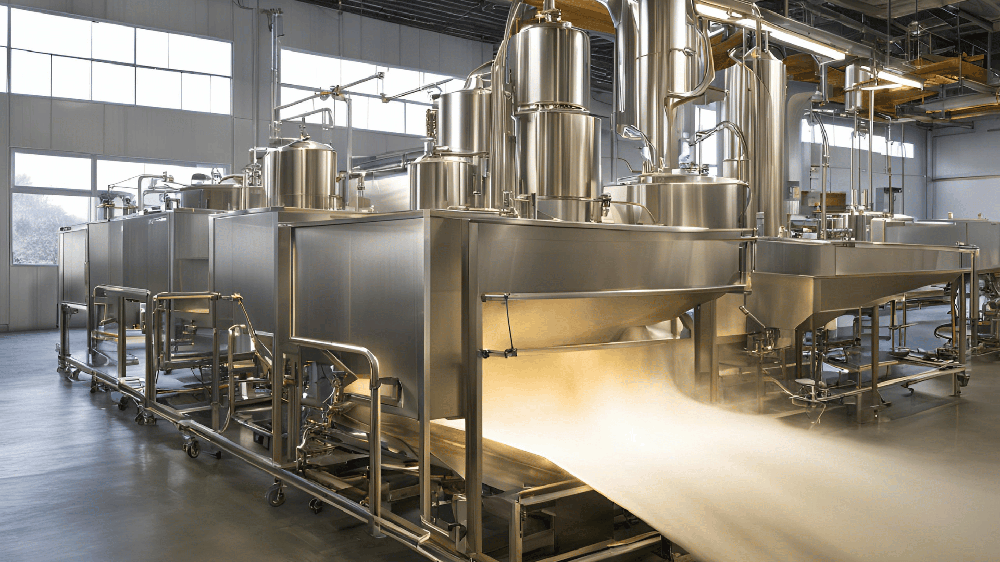

## Introduction

In the food industry, maintaining high production efficiency is crucial. One way to achieve this is through the use of advanced food spraying systems. These systems help apply glazes, oils, and emulsions to food products with precision and consistency. Custom food spraying solutions, like those offered by Saturn Spraying Systems, are designed to meet specific production needs. 

[They enhance the quality of food products, reduce waste, and ensure a smooth, efficient production process.](https://2ly.link/1yre1) By tailoring solutions to individual requirements, Saturn Spraying Systems helps businesses improve their overall efficiency and product quality.

## Section 1: Understanding Food Spraying Systems

### Definition and Purpose of Food Spraying Systems

[Food spraying systems are advanced machines used in the food industry](https://2ly.link/1yrdn) to apply coatings like glazes, oils, and emulsions to various food products. These systems ensure that the coatings are applied evenly and consistently, enhancing the appearance, flavor, and shelf life of the products.

### Key Components and Technology

One of the standout features of food spraying systems is the spinning disc technology. This technology uses a high-speed spinning disc to atomize the coating liquid, creating a fine mist that covers the food products uniformly. This method is highly efficient and ensures minimal waste.

### Benefits of Using Food Spraying Systems

Using food spraying systems offers several benefits:

- **Consistency**: Ensures even application of coatings, leading to uniform product quality.
- **Efficiency**: Reduces waste and optimizes the use of coating materials.
- **Precision**: Allows for precise control over the amount and location of the coating applied.
- **Quality Improvement**: Enhances the visual appeal and taste of the food products.

By incorporating these systems into their production lines, food manufacturers can significantly boost their efficiency and product quality.

## Section 2: The Role of Custom Solutions

### The Role of Custom Solutions

In the world of food production, custom solutions are crucial for making operations more efficient and meeting specific needs. Food spraying systems, like those offered by Saturn Spraying Systems, show how customized approaches can solve diverse production challenges.

### What are Custom Food Spraying Solutions?

Custom food spraying solutions are designed to fit exactly what food manufacturers need. Saturn Spraying Systems specializes in using advanced spinning disc spray technology to create systems that match each client’s production line and product requirements. This customization ensures that every spraying solution not only works well but also helps companies save time and resources.

### Meeting Specific Production Needs

Saturn’s custom approach involves understanding each client's unique production process and goals. By doing this, Saturn’s engineers can design solutions that improve coating accuracy, reduce waste, and boost productivity. Whether it’s fitting into a tight space with the PortaDisc™ system or covering products thoroughly with the DiscMaster™, these solutions are made to fit seamlessly into existing setups.

### Examples of Customized Solutions Offered by Saturn Spraying Systems

Saturn Spraying Systems offers a variety of tailored solutions that show their ability to meet different production needs:

- **DiscNomic™**: [A simple machine that sprays only from the top,](https://2ly.link/1yrdg) perfect for basic applications that need precise coating.
- **DiscMaster™**: Great for small to medium-sized businesses, [this system can spray precisely from the top or all over](https://2ly.link/1yrdk), giving flexibility in how products are coated.
- **DiscMatic™**: Made for large conveyor production lines, offering [professional-grade spraying across bigger setups.](https://2ly.link/1ysMG)
- **PortaDisc™**: Specifically designed for [places where space is tight](https://2ly.link/1ysMM) or there’s already a conveyor, giving the option to spray from the top without losing performance.
- **Sprinkling Machine**: This special system spreads granular products evenly, improving how [products look and ensuring consistency.](https://2ly.link/1ysMW)

Each of these solutions shows how Saturn Spraying Systems delivers not just machines, but systems that make operations smoother and raise the quality of products in food production.

## Section 3: Enhancing Production Efficiency

[Food spraying systems are instrumental in improving production efficiency](https://2ly.link/1yrdn) across the food industry. Saturn Spraying Systems’ technology plays a significant role in achieving these improvements.

### How Food Spraying Systems Improve Efficiency

Food spraying systems, like those from Saturn Spraying Systems, streamline production by ensuring coatings like glazes, oils, and emulsions are applied consistently and precisely. This consistency reduces waste and boosts yield, making operations more efficient and cost-effective.

### Reducing Waste and Increasing Yield

By using precise spraying technology, Saturn’s systems minimize overspray and ensure that coatings are applied exactly where needed. This targeted application not only saves ingredients but also enhances product quality by maintaining uniformity.

### Consistent and Precise Application

Saturn’s spraying systems excel in their ability to apply coatings evenly, whether it's a light glaze or a thick oil. This uniform application helps food manufacturers consistently maintain product standards and meet consumer expectations.

## Section 4: Case Studies and Customer Success Stories

Real-world examples and testimonials highlight the practical benefits of Saturn Spraying Systems’ solutions in enhancing production efficiency and product quality.

### Real-World Examples

Saturn Spraying Systems has successfully implemented their spraying solutions in various food production settings, demonstrating significant improvements in efficiency and product consistency. For instance, in a bakery setting, the DiscMaster™ system enabled precise application of glazes, resulting in reduced waste and consistent product finish. Similarly, in a snack manufacturing facility, the PortaDisc™ system’s adaptability allowed for efficient top-only spraying, optimizing production without requiring extensive line modifications.

### Testimonials from Satisfied Customers

Customer feedback underscores the effectiveness of Saturn’s custom solutions in meeting operational goals and enhancing overall production outcomes. According to one client testimonial, the DiscMatic™ system not only improved coating precision but also reduced maintenance downtime, ensuring uninterrupted production cycles.

### Specific Improvements and Benefits

Clients have reported measurable improvements such as increased throughput and reduced product defects. The Sprinkling Machine, for instance, has enabled precise distribution of granular ingredients, enhancing product aesthetics and consistency across batches.

## Section 5: Sustainability and Environmental Benefits

Saturn Spraying Systems is committed to sustainability through efficient resource utilization and reduced environmental impact.

### Focus on Reducing Waste and Improving Efficiency

By optimizing coating application, Saturn’s systems minimize material waste and maximize product yield. This efficiency not only enhances operational profitability but also supports sustainable practices in food production.

### Environmental Impact of Food Spraying Systems

Saturn’s technology contributes to environmental sustainability by reducing excess coatings and ensuring precise application, [which minimizes the environmental footprint associated with food processing.](https://2ly.link/1yre1)

### Custom Solutions and Sustainable Practices

Through customized spraying solutions, Saturn helps food manufacturers achieve sustainability goals by promoting efficient resource management and minimizing waste generation. This aligns with global efforts to adopt eco-friendly practices in food production.

## Conclusion

 Saturn Spraying Systems stands at the forefront of food spraying technology, offering custom solutions that significantly enhance production efficiency and product quality. By leveraging advanced spinning disc spray technology and a commitment to customer satisfaction, Saturn ensures that food manufacturers worldwide achieve higher operational efficiency, reduce waste, and maintain consistent product standards.

 Whether it's adapting to unique production challenges or supporting sustainable practices, Saturn Spraying Systems remains dedicated to driving innovation and excellence in the food manufacturing industry.

[Join the satisfied customers worldwide and discover the difference with Saturn Spraying.](https://2ly.link/1yreB)
