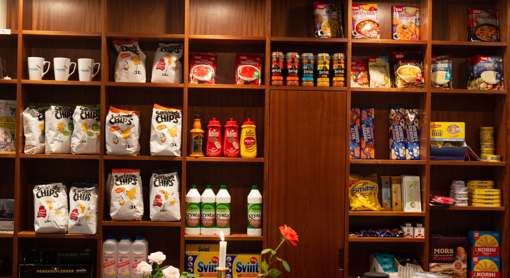
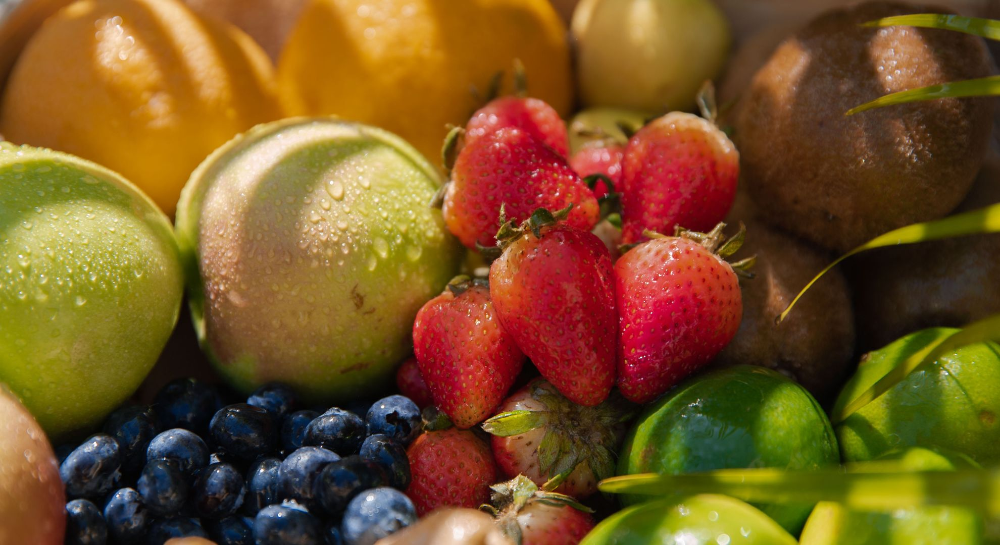

In 2024, modern food spraying automation is playing a crucial role in boosting shelf life across the food industry. These advanced systems, like the AutoJet Bioprotection Spraying System, have been developed to address challenges like food spoilage, waste, and quality deterioration. By utilizing precision spray control (PSC) technology, producers can accurately apply protective substances, such as bioprotection solutions, to food products. This method not only reduces waste but also ensures a consistent application, thus extending product shelf life, particularly in sectors like [meat](/applications/meat_fish_products/), bread, frozen food and [fruits, vegetables](/applications/fruit_vegetables/).

Let’s face it, food spoilage is like the ultimate party crasher. You buy the perfect avocados, tomatoes, or freshly baked bread, and just when you’re ready to dive in, they’ve already waved the white flag.

But here’s the good news: In 2024, Food Spraying Automation, tackling spoilage head-on and giving your favorite foods a much longer stay in your kitchen! Curious? Let’s dive into how this tech is changing the game, and why we’re all here for it.

## The Problem: Shelf Life, or Lack of It ?

We’ve all been there. You buy produce or bread with the best intentions, and by day 4, the reality of wilting lettuce or stale rolls sets in. It feels like a losing battle to keep our food fresh and our wallets happy. The food industry has been searching for solutions to extend shelf life without sacrificing taste or quality and that’s where Food Spraying Automation steps in.

But what is it? And why is it making waves in 2024?

## Food Spraying Automation: The 2024 Solution to Spoilage

These sprays form a protective barrier that slows down the aging process, locks in moisture, and keeps the food fresher for longer.

Here’s what makes it special:

- **Consistency**: Automation ensures that the spray is applied evenly, giving every inch of the product the protection it needs.
- **Efficiency**: Machines work faster than humans can, allowing manufacturers to treat larger quantities of food in less time. That means more food stays fresher for longer.
- **Natural Ingredients**: The best part? These sprays are made from food-safe, often natural compounds that protect your food without altering its flavor or nutritional value. No Frankenstein foods here!

## 2024: The Year of Smarter, Longer-Lasting Food

Why is 2024 the year of Food Spraying Automation? Because the tech has finally matured to the point where it’s scalable, affordable, and eco-friendly. With more focus on sustainability and reducing food waste, this technology is getting the attention it deserves. After all, who wouldn’t want to cut down on food waste while keeping that farm-fresh taste for longer?

## The Hidden Power of These Sprays

These sprays don’t just keep food fresh, they actually help maintain that just-harvested look and feel. You know that perfect shine on apples or the crispness of lettuce that makes you want to bite in right away? That’s what Food Spraying Automation helps preserve.

It’s like giving your food an extended vacation, where they come back looking fresh, delicious, and ready to eat. Who wouldn’t want that?

## What Does This Mean for Us?

For manufacturers and consumers alike, [Food Spraying Automation](/food-spraying-how-saturn-spraying-is-transforming-food-production/) is a game-changer. For businesses, it means less food waste, longer shelf life, and happier customers. For you? It means your favorite foods last longer and stay fresh, so you don’t have to play that “eat it before it expires” game every week.

So Overall, 2024 is seeing a surge in the adoption of these technologies, enabling food producers to not only improve their product longevity but also ensure sustainable and scalable food preservation practices.

**[Curious About Food Spraying?](/contact) Subscribe to our newsletter and STAY TUNED!**
