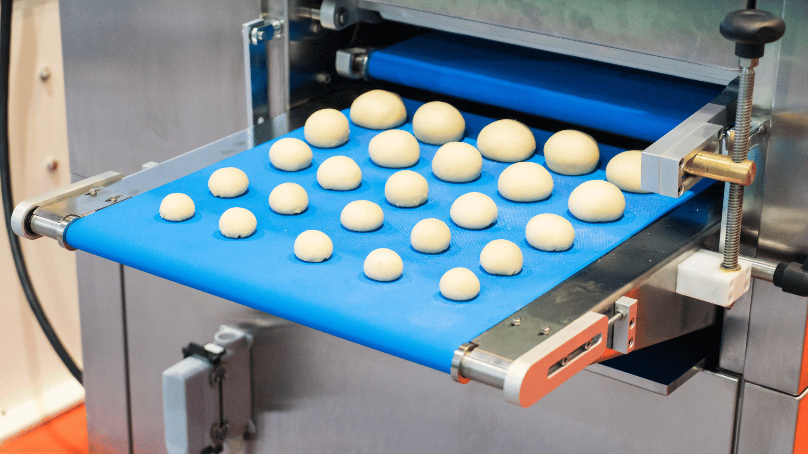
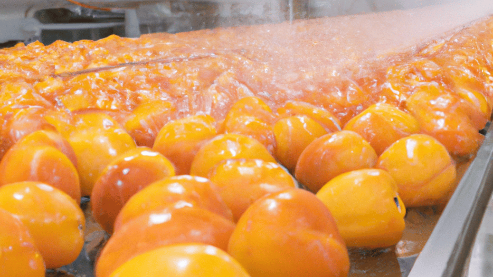

## Food Spraying Technology

Food preservation and quality matter more than ever, and food spraying technology is a game-changer. Imagine a fine mist enveloping your favorite fruits, vegetables, and baked goods, enhancing their freshness and extending their shelf life. Let’s delve into this innovative process and discover how it impacts our daily meals.

### What is Food Spraying Technology?

At its core, food spraying technology involves applying a protective layer to food items. This layer serves multiple purposes:

- **Preservation:** The sprayed coating acts as a natural barrier, preventing moisture loss and inhibiting the growth of harmful microorganisms. Say goodbye to wilted lettuce and moldy bread!
- **Enhanced Flavor and Appearance:** Food sprays can add a touch of magic. Picture glossy chocolate-covered strawberries or perfectly golden croissants. These coatings not only protect but also make our food visually appealing.
- **Nutrient Retention:** Some sprays infuse vitamins and minerals, ensuring that our meals remain nutritious even after days on the shelf.

## Benefits of Food Spraying Technology in the Food Industry

Food spraying technology offers many benefits to the food industry:

- **Improved Food Quality:** By evenly spraying ingredients, flavors are more consistent in every bite. This makes the food taste better and more enjoyable for everyone.
- **Food Preservation:** Spraying preservatives evenly on food items ensures that they stay fresh for a longer time. This reduces the chances of spoilage and waste, making food safer to eat and more reliable for consumers.
- **Efficiency and Cost-Effectiveness:** Traditional methods of applying ingredients can be slow and uneven. Food spraying technology speeds up this process, allowing food to be produced faster. This is beneficial for businesses because they can make more products in less time and at a lower cost.
- **Precision:** The technology allows for exact amounts of ingredients to be used, maintaining the nutritional value of food. This precision ensures there is no overuse or underuse of ingredients, making the food healthier.

## The Role of Spinning Disc in Food Spraying Technology

Spinning disc spray technology is integral to various industries, particularly in food applications. This method employs rotating discs to evenly distribute liquids onto surfaces, ensuring precise and uniform coating.

### Advantages of Spinning Disc Spray Technology:

- **Delicate Coating:** It excels in coating delicate or irregularly shaped food items without compromising their integrity. Whether it's fruits, vegetables, or bakery products, this technology ensures uniform coverage without causing damage.
- **Versatility:** It accommodates a wide range of liquid ingredients, including oils, seasonings, preservatives, and antimicrobial solutions. This versatility allows for customization based on specific processing requirements, enhancing product quality and safety.

## Saturn Spraying's Food Spraying Technology

Saturn Spraying is a renowned global supplier, celebrated for its cutting-edge solutions in food spraying applications. At the forefront of spinning disc spray technology, we deliver high-quality, innovative solutions tailored to meet the diverse needs of our clients worldwide.

### Transforming Food Spraying Technology: Saturn's Precise Approach

Saturn Spraying specializes in food spraying technology, offering cost-effective and innovative solutions to meet the unique requirements of our customers. Our personalized approach, coupled with advanced technologies, ensures client satisfaction and operational excellence.

### Key Features of Saturn's Food Spraying System Design:

- **Precision:** We prioritize understanding our client's specific needs and challenges to develop customized spraying solutions that integrate seamlessly into their production lines.
- **Reliability and Flexibility:** Our system design services are characterized by precision, reliability, and flexibility.

## Quality, Reliability, and Customer Satisfaction

Saturn Spraying is dedicated to upholding the highest standards of quality and reliability in all our products. Our unwavering commitment to excellence ensures that every spraying system we deliver meets rigorous quality control measures, guaranteeing optimal performance and longevity.

- **Quality:** From design and fabrication to installation and maintenance, we adhere to strict quality assurance protocols to ensure that each component and system meets our stringent standards.
- **Reliability:** We understand the critical role our spraying systems play in our client's operations, and we strive to deliver solutions that they can rely on day in and day out.

## Conclusion

Saturn Spraying stands as a beacon in the realm of food spraying technology. Our bespoke system design and engineering services exemplify our dedication to innovation, precision, and client satisfaction. With a keen understanding of our clients' needs, we craft customized solutions that integrate seamlessly into their production processes, driving efficiency and quality.

If you're ready to take your food spraying technology to new heights, partner with Saturn Spraying for innovative solutions tailored to your specific needs. Contact us today to learn more about how we can drive productivity, efficiency, and profitability for your business.
