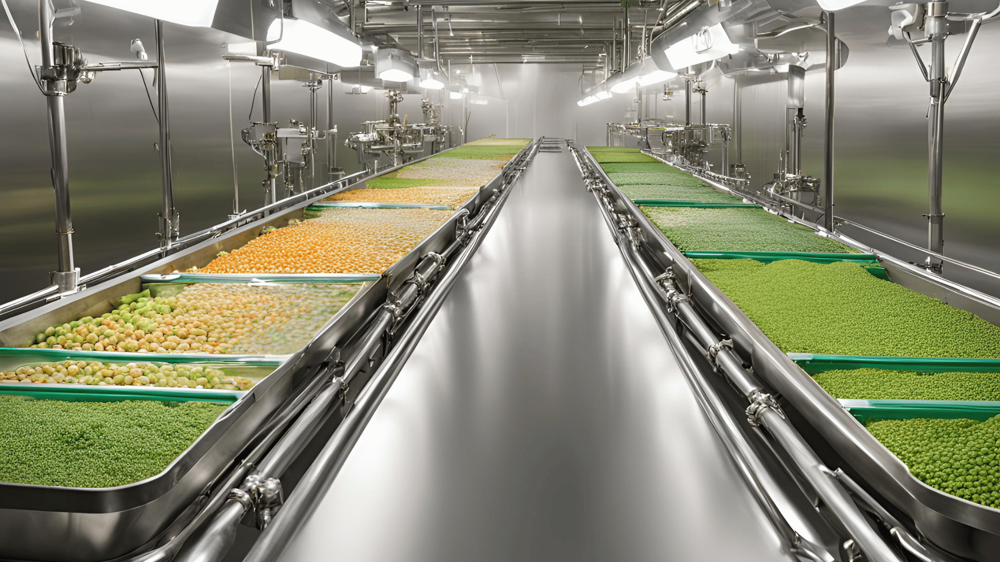
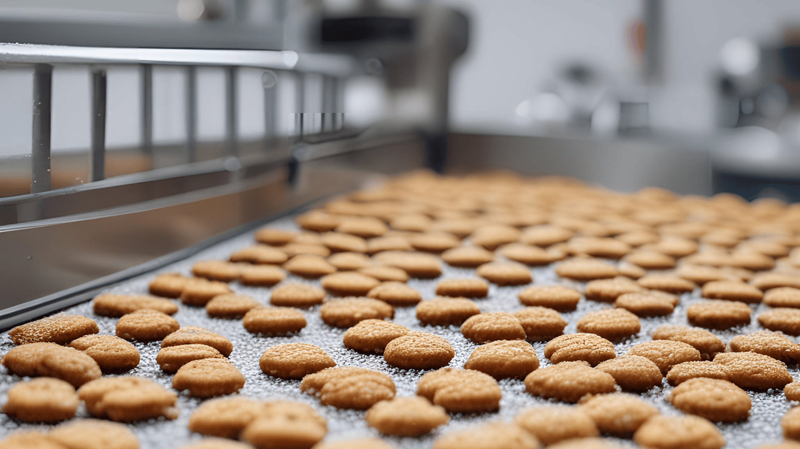
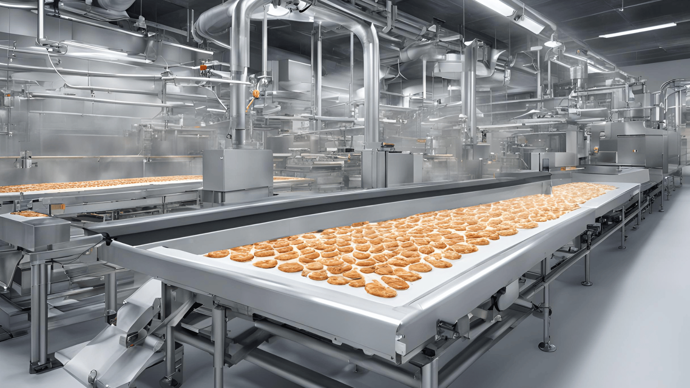
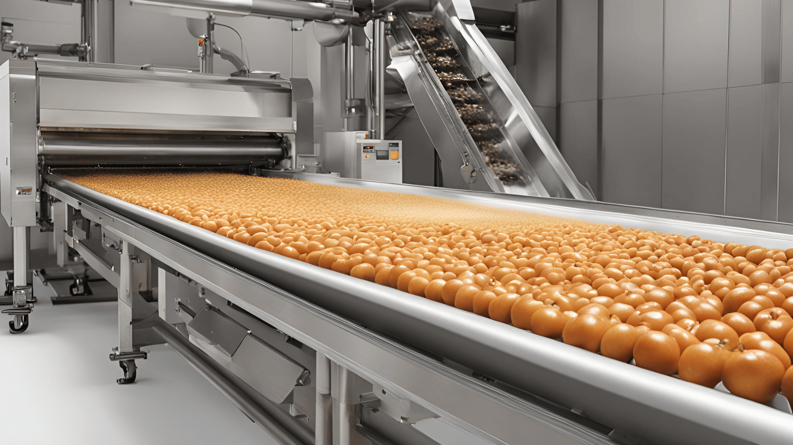

Food preservation is vital for keeping our food fresh, safe, and nutritious for longer periods. With the world’s growing population and food demands, finding effective ways to preserve food is more important than ever.[ Saturn Spraying Systems](/food-spraying-systems-in-the-food-production-industry-saturn-spraying-leading-the-way/) is a global leader in food spraying technology, providing innovative solutions that help maintain food quality. Their advanced spraying systems ensure the precise application of glazes, oils, and emulsions, which are essential for preserving food and enhancing its appearance and taste.

This blog will explore how Saturn Spraying Systems is revolutionizing food preservation. We will look at their cutting-edge technology, the benefits it offers, and how it meets the needs of modern food production.

## The Role of Food Spraying Systems in Modern Food Production

Food spraying systems are tools used in factories to evenly coat food with substances like oils, glazes, and emulsions. These systems help in applying these coatings quickly and accurately. By using food spraying systems, food producers can ensure that each product gets the exact amount of coating, making it look and taste better.

Precision and consistency are crucial in food spraying. With accurate spraying, each food item receives the same amount of coating, which helps in maintaining quality. This consistency is important because it ensures that all products are uniform, which is something customers expect.

[Advanced food spraying systems](/food-spraying-technology-saturn-spraying-reshaping-the-food-industry/) offer many benefits. They reduce waste by using the exact amount of coating needed, saving money and resources. They also improve productivity by speeding up the coating process and reducing the need for manual labor. Overall, these systems make food production more efficient and cost-effective.

## Saturn Spraying Systems: A Pioneer in Food Spraying Technology

[Saturn Spraying Systems has been a leader in food spraying technology](/food-spraying-systems-in-the-food-production-industry-saturn-spraying-leading-the-way/) since the late 1980s. With decades of experience, Saturn has grown into a global company, installing its advanced machines in major food-producing countries all over the world. Their technology focuses on spinning disc spray systems, which are used to evenly apply glazes, oils, and emulsions onto food products.

The spinning disc spray technology is one of Saturn's key innovations. This technology works by using a high-speed rotating disc to break up liquids into fine droplets, which are then sprayed evenly onto food items. This method ensures a uniform coating, which is essential for maintaining the quality and appearance of food products. By using spinning disc spray technology, food manufacturers can achieve consistent results with minimal waste. This precision helps food producers improve the quality and consistency of their products.

Saturn’s dedication to innovation and quality has made them the go-to choice for many well-known food brands. Their systems are designed to be easy to use and maintain, reducing downtime and increasing productivity. By combining expertise with cutting-edge technology, Saturn Spraying Systems continues to revolutionize the food industry, making food processing more efficient and reliable. Their commitment to customer satisfaction and high-quality solutions sets them apart as pioneers in the field of food spraying technology.

## Innovative Solutions and Technology

Saturn Spraying Systems offers advanced solutions with their unique spinning disc spray technology. This technology allows for precise spraying of glazes, oils, and emulsions onto food products. Precision is key in food production because it ensures even coating, which improves the quality and taste of the food.

One major benefit of this technology is its ability to boost productivity. With more efficient spraying, food production lines can operate faster and produce more items. Additionally, the closed system spraying reduces waste, meaning less product is lost during the process. This not only saves money but also helps the environment by reducing waste.

Saturn Spraying Systems uses high-quality, industry-standard components in their machines. These include inverter/motor combination sets, conveyors, motors, pumps, and gearboxes. These parts are known for their reliability and durability, ensuring that the machines run smoothly and require less maintenance. This combination of precision, efficiency, and high-quality components makes Saturn's technology a top choice for food producers looking to improve their operations.

## Customization and Client Satisfaction

At Saturn Spraying Systems, we understand that every client has unique needs. That's why we offer bespoke system designs tailored specifically for each client. Our customized solutions ensure that our food spraying systems [fit perfectly into your existing production lines without compromising performance.](/food-spraying-technology-saturn-spraying-reshaping-the-food-industry/)

The benefits of our customized solutions are numerous. They allow for greater efficiency, less waste, and improved product quality. For example, one of our clients needed a system to spray a specific type of glaze onto their bakery products. We designed a bespoke system that not only met their requirements but also reduced their production time by 20%.

Another example is a dairy producer who required precise spraying of oils and emulsions. Our tailored system provided them with consistent results, enhancing the taste and appearance of their products. With Saturn’s customization, clients always get solutions that perfectly match their needs, ensuring maximum satisfaction.

## Advantages of Saturn Spraying Systems

Saturn Spraying Systems offer many advantages that make them stand out in the food industry. Their spinning disc technology ensures high-quality and consistent spraying of glazes, oils, and emulsions on food. This means that the food looks and tastes better, improving the overall product quality and performance.

One of the biggest benefits is the savings through efficient spraying systems. Saturn's technology reduces waste by precisely controlling the amount of spray used, which helps save money and resources. The systems are also very easy to use and control. Even with minimal training, workers can operate the machines efficiently. This simplicity reduces errors and increases productivity.

Additionally, Saturn provides a robust support system to ensure continuous operation. Their excellent after-sales support minimizes downtime and quickly resolves any issues. This helps maintain smooth and efficient food production lines, making Saturn Spraying Systems a reliable choice for food manufacturers.

## Conclusion

The advancement of food spraying systems plays a crucial role in preserving food quality and enhancing production efficiency. These systems ensure that glazes, oils, and emulsions are applied with precision and consistency, reducing wastage and improving overall product yield. Saturn Spraying Systems stands at the forefront of this technology, pioneering solutions that meet the diverse needs of the food industry.

Saturn’s impact on food production is profound, offering tailored spraying solutions that elevate product quality while optimizing operational costs. Their commitment to innovation and reliability ensures that clients worldwide benefit from state-of-the-art spinning disc spray technology.

Saturn’s food spraying systems can help you achieve this and more. Our advanced technology ensures precise and consistent spraying, which can boost your productivity and save you money by cutting down on waste. With our easy-to-use systems and top-notch support, you can quickly see the benefits in your operations.

[Contact us today](/contact) to learn how our solutions can help you achieve better results and keep your business ahead of the curve!
