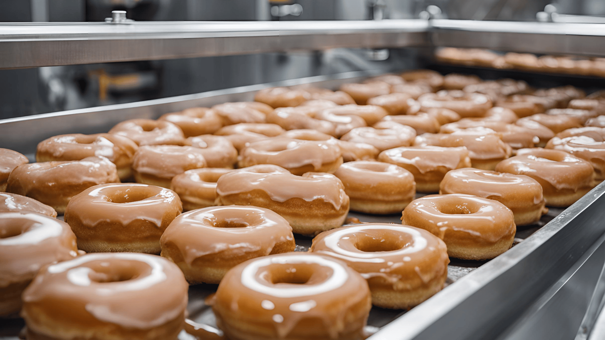
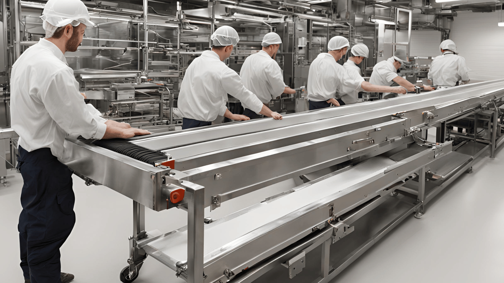
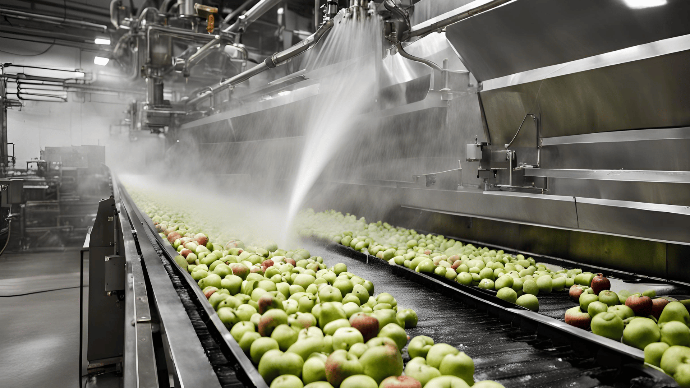

## Introducing Saturn Spraying: Leaders in Food Spraying Technology

Saturn Spraying stands as a global leader renowned for its cutting-edge solutions in food spraying applications. Specializing in the innovative spinning disc spray technology, Saturn has consistently delivered high-quality solutions that redefine food processing experiences worldwide. With a legacy dating back to the late 1980s, Saturn Spraying Systems Limited has continually pushed the boundaries of [food spraying technology](/food-spraying-systems-in-the-food-production-industry-saturn-spraying-leading-the-way/), earning the trust of customers globally.

## Commitment to Quality and Innovation at Saturn Spraying

At Saturn Spraying, quality and innovation are the cornerstones of our ethos. We are committed to maintaining the highest standards of excellence in every aspect of our operations, from design and fabrication to customer service. Our relentless pursuit of innovation drives us to explore new possibilities, ensuring that our customers receive the most advanced and effective food spraying solutions available in the market. This dedication to quality and innovation has earned Saturn Spraying a reputation for reliability and excellence in the food industry.

## Benefits of Buying Food Spraying Machines

Food spraying machines offered by Saturn Spraying bring a myriad of benefits to food production processes. From enhancing productivity and yield to ensuring precision and repeatability in glazing, oiling, and emulsifying, our machines revolutionize manufacturing processes. With controlled spraying mechanisms and minimal wastage, Saturn's food spraying machines not only improve product quality but also optimize operational efficiency, providing tangible benefits for modern food production facilities.

- **Enhanced Productivity and Yield**:
  - Increase the throughput of food manufacturing processes.
  - Enable higher production rates, allowing factories to meet growing demand efficiently.
  - Reduce downtime with reliable, high-performance equipment.

- **Precision in Glazing, Oiling, and Emulsifying**:
  - Achieve uniform coating application, ensuring consistent product quality.
  - Fine-tuned control over the amount and distribution of sprayed substances.
  - Maintain product standards and specifications with every batch.

- **Repeatability**:
  - Ensure that every production run meets the same high standards.
  - Reduce variability in the manufacturing process, leading to fewer defects.
  - Facilitate compliance with industry regulations and standards.

- **Controlled Spraying Mechanisms**:
  - Minimize overspray and spillage, reducing waste and saving costs.
  - Enhance accuracy in application, crucial for sensitive food processing tasks.
  - Support precise adjustments to meet specific product requirements.

- **Minimal Wastage**:
  - Optimize the use of ingredients and coatings, leading to cost savings.
  - Contribute to a more sustainable production process by reducing excess waste.
  - Improve overall resource management within the manufacturing facility.

- **Improved Product Quality**:
  - Enhance the visual appeal and texture of food products with consistent coating.
  - Maintain the desired taste and nutritional value by accurate application of ingredients.
  - Reduce the risk of contamination and spoilage with hygienic spraying systems.

- **Operational Efficiency**:
  - Streamline production workflows, reducing the time required for manual processes.
  - Lower operational costs by automating labor-intensive tasks.
  - Increase the overall efficiency of the manufacturing plant, leading to higher profitability.

- **Versatility**:
  - Adaptable to a wide range of food products and manufacturing scenarios.
  - Capable of handling different types of coatings and ingredients with ease.
  - Suitable for both small-scale and large-scale food production facilities.

- **Ease of Maintenance and Operation**:
  - User-friendly designs that simplify training and operation.
  - Low maintenance requirements, reducing the need for frequent repairs.
  - Quick and easy cleaning processes, maintaining hygiene standards.

- **Support and Service**:
  - Access to comprehensive after-sales support, including troubleshooting and spare parts.
  - On-site training and installation assistance to ensure smooth integration into production lines.
  - Dedicated customer service team available to address any concerns promptly.

Saturn's food spraying machines provide these benefits and more, making them a valuable addition to any modern food production facility.

## Specialization in Food Spraying Technology

Saturn Spraying Systems Limited has carved a niche for itself as a specialist in food spraying technology. With a focus on delivering optimal solutions for food spraying applications, Saturn leverages cutting-edge spinning disc spray technology to achieve precise and consistent results. The company's in-depth understanding of the intricacies of food spraying processes allows it to develop customized solutions tailored to the unique needs of each client. Whether it's glazing, oiling, or emulsifying, Saturn's expertise ensures that food products are coated with precision and efficiency, meeting the highest standards of quality and consistency.

## Dedication to Customer Satisfaction and Innovation

At Saturn Spraying, customer satisfaction is paramount. The company is dedicated to exceeding customer expectations by providing innovative solutions that address their specific challenges and requirements. Saturn's commitment to innovation drives continuous improvement and the development of new technologies to stay ahead of industry trends. By collaborating closely with customers and leveraging their feedback, Saturn ensures that its solutions are always at the forefront of technological advancements, delivering maximum value and performance.

## Global Presence and Reputation for Excellence

Saturn Spraying has established a strong global presence, serving clients in various industries across the world. With installations in key food manufacturing countries across Asia, South America, and Australia, Saturn's reputation for excellence precedes it. The company's proven track record of delivering high-quality spraying solutions and providing exceptional customer service has earned it the trust and loyalty of clients worldwide. Whether it's a multinational corporation or a small-scale producer, Saturn's commitment to excellence remains unwavering, making it the preferred choice for [food spraying technology](/food-spraying-systems-in-the-food-production-industry-saturn-spraying-leading-the-way/) solutions globally.

## Quality and Reliability of Saturn's Spraying Systems

Saturn Spraying Systems Limited prides itself on delivering spraying systems of unmatched quality and reliability. Each system is meticulously designed and manufactured to meet the highest industry standards, ensuring consistent performance and durability. With a focus on precision engineering and rigorous quality control processes, Saturn's spraying systems are built to withstand the demands of modern food production environments. Customers can trust Saturn's systems to deliver reliable performance day in and day out, maximizing productivity and minimizing downtime.

## Benefits of Saturn's Closed System Spraying

One of the key advantages of Saturn's spraying systems is their closed system design. This design minimizes wastage by providing precise control over the spraying process, ensuring that only the required amount of coating is applied to each product. By preventing overspray and spillage, Saturn's closed system spraying helps reduce product waste and improve overall efficiency. The closed system design maintains a clean and hygienic production environment, reducing the risk of contamination and ensuring product safety.

## Simplicity of Use and High Levels of After-Sales Support

Saturn's spraying systems are designed with user-friendliness in mind, making them easy to operate and maintain. Intuitive controls and straightforward interfaces allow operators to quickly learn how to use the systems effectively, minimizing training time and maximizing productivity. Saturn provides comprehensive after-sales support to ensure that customers get the most out of their spraying systems. From installation assistance to troubleshooting guidance and spare parts availability, Saturn's dedicated support team is committed to helping customers succeed. With Saturn, customers can trust that they will receive the assistance they need, whenever they need it, ensuring a seamless experience from purchase to operation.

## Saturn's Location on the Ferndown Industrial Estate

Situated on the Ferndown Industrial Estate, near Bournemouth, Saturn [Food Spraying Systems](/food-spraying-systems-in-the-food-production-industry-saturn-spraying-leading-the-way/) Limited enjoys a strategic location with excellent access to transportation routes. This prime location provides Saturn with convenient connections to modern road, rail, and air distribution networks, facilitating efficient business operations. Being only 5 km away from Bournemouth International Airport further enhances Saturn's accessibility for both domestic and international travel, streamlining logistics and ensuring prompt delivery of products and services to clients worldwide.

## Global Installed Base and Customer Satisfaction

Saturn boasts an impressive worldwide installed base, reflecting the company's extensive reach and commitment to customer satisfaction. With 249 satisfied customers spanning across 25 countries, Saturn's presence extends far beyond its headquarters. These installations, totaling 68 stations, serve as a testament to the reliability and effectiveness of Saturn's spinning disc spraying technology in meeting the diverse needs of clients across various industries and geographical regions.

## Commitment to Supporting Spinning Disc Installations Worldwide

Saturn Food Spraying Systems Limited is dedicated to providing comprehensive support for its spinning disc installations worldwide. Recognizing the importance of maintaining peak performance and efficiency, Saturn offers a range of services aimed at ensuring the seamless operation of its spraying systems. This includes on-site training during the installation process to instill confidence in operators and build valuable working relationships with maintenance staff. Saturn prioritizes prompt responsiveness to any issues that may arise, offering diagnostic assistance, recommendations for optimizing performance, and timely delivery of spare parts when needed. By prioritizing customer support and satisfaction, Saturn reaffirms its commitment to delivering unparalleled value and reliability to clients worldwide.

## Conclusion

Considering food spraying machines from Saturn Spraying Systems Limited can truly enhance your food manufacturing process. With our advanced technology, dedication to quality, and worldwide recognition for excellence, Saturn offers solutions that go above and beyond. Take your manufacturing to the next level today for better processing outcomes with food spraying systems! For more information about our products and services, reach out to us or visit our website to explore our full range of offerings. Join the satisfied customers worldwide and discover the difference with Saturn Spraying.

[Join the satisfied customers worldwide and discover the difference with Saturn Spraying.](/contact)