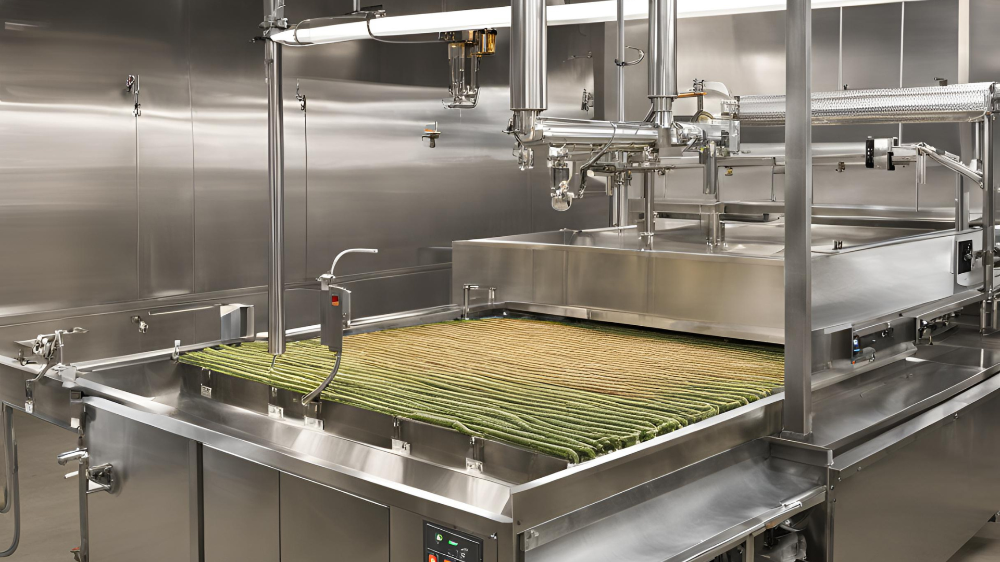
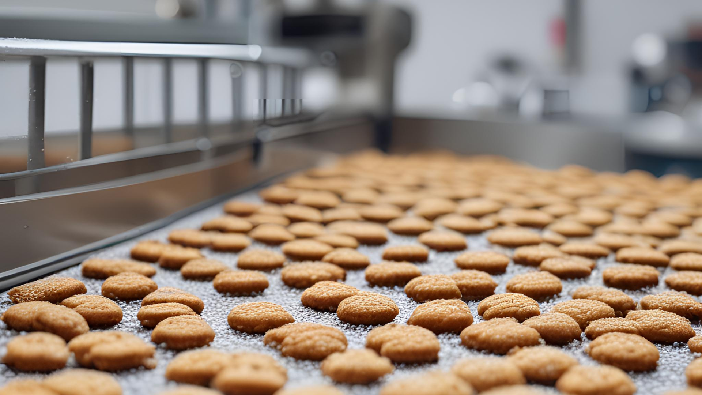
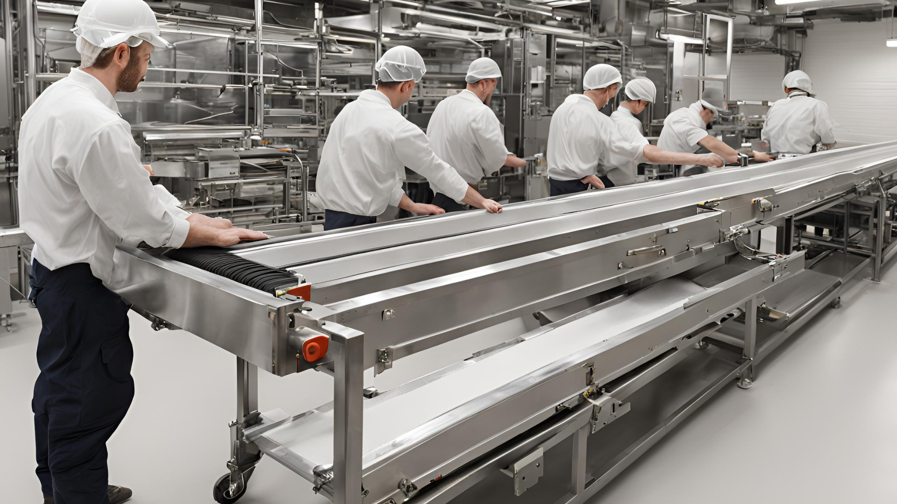

## Introduction
[Food spraying technology](https://2ly.link/1z8nb) is an important part of modern food production. It helps improve the quality, consistency, and efficiency of food products. This technology is used to apply glazes, oils, and emulsions to food, making them look better and last longer.

Saturn Spraying Systems is a global leader in this field, known for its innovative solutions and advanced technology. They focus on providing high-quality, custom spraying systems to meet the diverse needs of the food industry.

## What is Food Spraying?
Food spraying is the process of applying liquid substances, such as glazes, oils, and emulsions, onto food products. This process helps to add flavor, improve texture, or enhance the appearance of foods. Unlike traditional methods like brushing or dipping, food spraying offers a more controlled and even application.

This reduces waste and ensures that the coating is consistent. Food spraying is especially useful in large-scale food production, where maintaining uniform quality is important. Whether it’s adding a shiny finish to baked goods or applying a protective layer to fruits, food spraying plays a vital role in the food industry.

## The Technology Behind Food Spraying
The key to food spraying technology is the spinning disc spray system. This technology uses a spinning disc to break the liquid into fine droplets, which are then sprayed evenly onto the food. The spinning disc ensures that the application is uniform, regardless of the thickness of the liquid being used.

This method has several advantages over traditional techniques, such as reducing waste, providing precise control over the amount applied, and coating products evenly without touching them. [Saturn Spraying Systems has mastered this technology](https://2ly.link/1z8nb), offering solutions that work for different types of food products and production environments.

## Applications of Food Spraying
[Food spraying is used in many different areas of the food industry](https://2ly.link/1z8nd). For example, in bakery products, it can be used to apply glazes that give pastries a shiny, attractive finish. In the confectionery industry, it helps coat candies and chocolates with flavors or protective layers.

The dairy industry uses food spraying to apply emulsions that improve the texture and shelf life of products like cheese. Even fruits and vegetables can benefit from food spraying, as it provides coatings that protect them from spoilage and enhance their visual appeal. Saturn Spraying Systems has worked with many clients to develop custom spraying solutions that meet specific production needs.

## Saturn Spraying Systems’ Unique Approach
Saturn Spraying Systems stands out in the industry for its custom approach to food spraying. They understand the unique challenges faced by different sectors within the food industry and offer tailored solutions to meet specific client requirements.

Whether it’s a compact solution like the DiscNomic™ for small spaces or the high-capacity DiscMatic™ for large-scale production, Saturn’s range of products meets various needs. Their commitment to innovation is clear in their continuous development of new technologies and systems, ensuring they remain at the forefront of food spraying. This client-focused approach has earned Saturn a reputation for reliability and excellence.

## Benefits of Using Saturn Spraying Systems
One of the main benefits of using Saturn Spraying Systems is the consistency and precision they offer in the application process. This level of control not only improves the quality of the final product but also leads to significant cost savings by minimizing waste. Saturn’s systems are designed for ease of use, with simple controls and minimal maintenance needs, which further reduces downtime and operational costs.

Additionally, Saturn’s high-quality after-sales support ensures that clients receive ongoing assistance and training, helping them get the most out of their equipment. This comprehensive support package is a key reason why many leading food manufacturers choose Saturn Spraying Systems.

## Global Reach and Client Satisfaction
[With installations in key food manufacturing regions around the world](https://2ly.link/1z8ne), including Asia, South America, and Australia, Saturn Spraying Systems has a truly global reach. The company has served 249 satisfied customers across 25 countries, installing 68 stations that have transformed food production processes.

Saturn’s global presence is supported by a strong training and support system that ensures clients receive the necessary knowledge and resources to operate their spraying systems effectively. This customer-focused approach has earned Saturn a loyal client base, with many customers praising the company’s responsiveness and technical expertise. Saturn’s commitment to quality and innovation is evident in the positive feedback and repeat business they receive.

## Conclusion
Food spraying technology is a key part of modern food production, offering benefits in terms of quality, consistency, and efficiency. Saturn Spraying Systems, with its innovative solutions and customer-focused approach, has established itself as a leader in this field. From custom design to comprehensive after-sales support, Saturn provides the tools and expertise needed to meet the unique challenges of the food industry.

[Whether you’re looking to improve product quality or reduce waste, Saturn’s advanced technology can help you achieve your goals](https://2ly.link/1z8nh). To learn more about how Saturn Spraying Systems can benefit your business, visit their website or book a call with their experts today.
